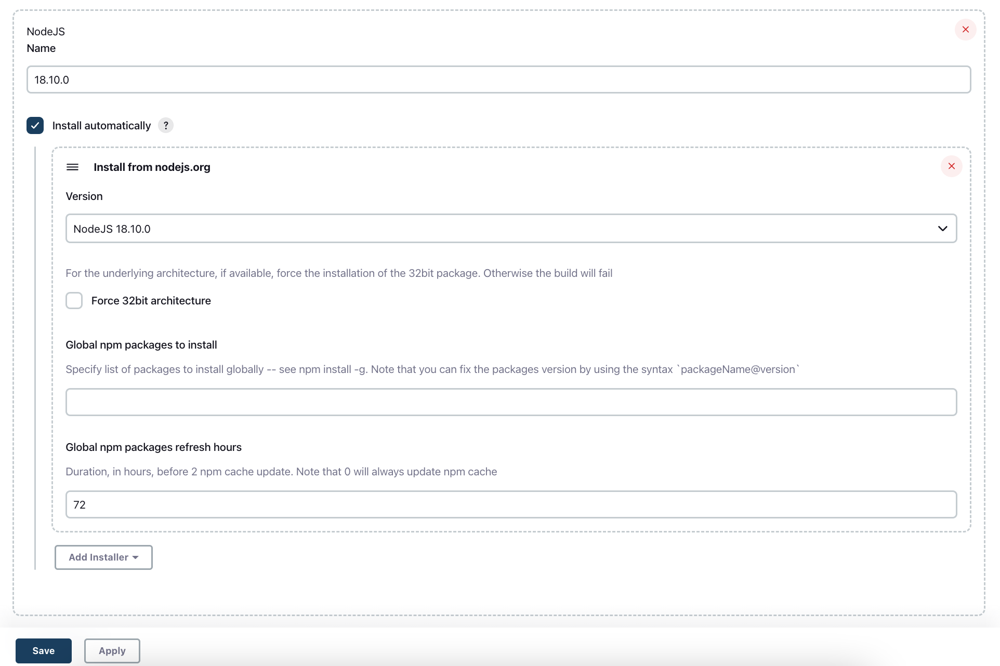

# This project were created for educational reason

## First part is a testing of eCommerce website, the second part about practical expirience with element location, interaction, wait commands etc.

## Framework

- WebdriverIO for configuring the connection to a browser
- Page object and page factory design patterns for pages
- Screenshot on fail with corresponding name and date
- Allure reporters, `wdio.conf.js` file updated: screenshot on failure, auto-cleaning reports after each test run
- Option to run from Jenkins with browser parametrization, selecting test suite, and log
- In `utils` custom commands are implemented
- Different tests suites are available

## Tools

- Webdriver I/O
- Jenkins
- Allure reporter

## Setup

- clone this repository
- install all dependencies for this project with `npm install`

## Jenkins Setup for local run

- launch your Jenkins server
- navigate to Manage Jenkins > Manage Plugins
- install `NodeJS Plugin`
- navigate to Manage Jenkins > Global Toll Configurations > NodeJS installations > Add Node JS
- choose version `NodeJs 18.10.0`
- to the name field add `18.10.0`

## Running job in Jenkins locally

- create a new pipeline
- pipeline script from SCM
- SCM (Git)
- change a path to Jenkins file `Jenkinsfile`
- use the current repo URL(your_repo)
- build now (will fail, because parameters will be provided after the first build)
- build with parameters (will run)

## Running test locally

- navigate to the project directory
- open terminal
- to run all tests `npx wdio`
- to run smoke test: `npm run smoke-suite`
